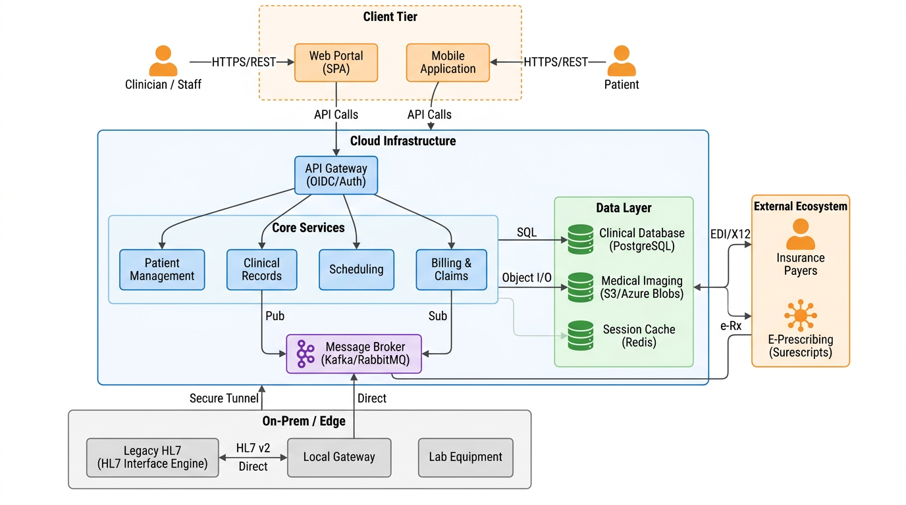
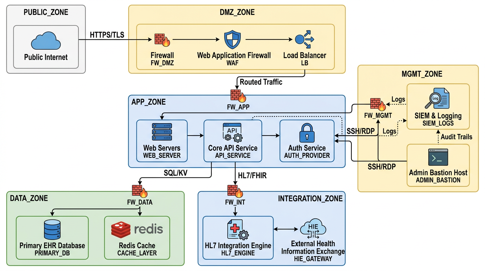
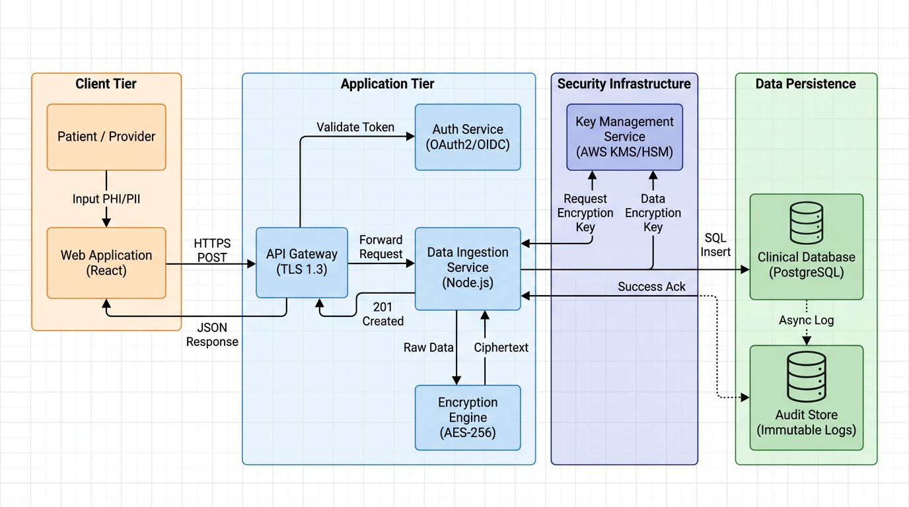
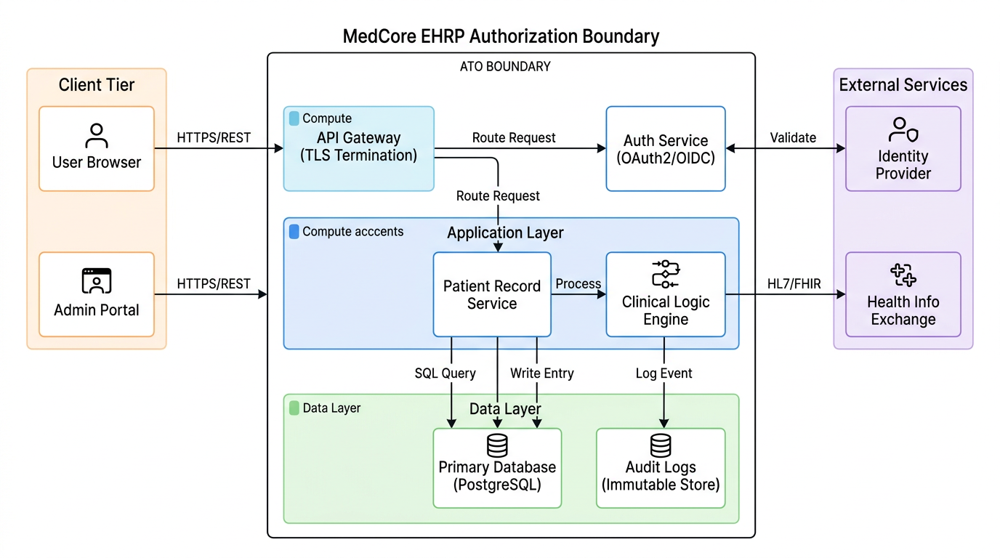
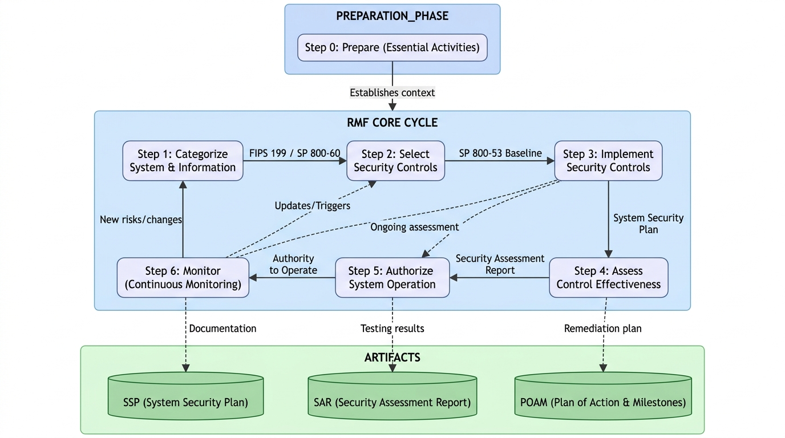

# MedCore Health Systems
## Fictional Baseline System — Cybersecurity Portfolio Foundation

> **Disclaimer:** MedCore Health Systems is a fictional organization created solely for cybersecurity portfolio demonstration purposes. All system names, personnel, data, and configurations described herein are fabricated. No real patient data, organizational data, or proprietary information is referenced or used.
>
> ---
>
> ## Purpose
>
> MedCore Health Systems serves as the consistent baseline environment referenced across all projects in this cybersecurity portfolio. Every security control, policy, risk assessment, compliance audit, vulnerability scan, and architecture diagram in this portfolio applies to this system. This approach mirrors how real-world GRC professionals operate — all security work is anchored to a defined system with a documented boundary, classification, and regulatory scope.
>
> ---
>
> ## Organization Overview
>
> | Field | Detail |
> |-------|--------|
> | **Organization Name** | MedCore Health Systems |
> | **Organization Type** | Regional Healthcare Provider |
> | **Headquarters** | Atlanta, Georgia |
> | **Operational Footprint** | 3 hospital campuses, 12 outpatient clinics, 1 central data center |
> | **Workforce** | Approximately 4,200 employees |
> | **Patient Population** | Approximately 280,000 active patients |
> | **Annual Revenue** | $820 million (fictional) |
> | **IT Staff** | 110 full-time technology and security personnel |
>
> ---
>
> ## System Description
>
> **System Name:** MedCore Electronic Health Records Platform (EHRP)
> **System Abbreviation:** EHRP
> **Version:** 4.2.1
> **System Type:** Major Application / General Support System
> **Operational Status:** Operational
> **System Owner:** Chief Information Security Officer (CISO)
> **Information System Security Officer (ISSO):** Director of Cybersecurity & Compliance
> **Authorizing Official (AO):** Chief Executive Officer (CEO)
>
> The MedCore EHRP is a centralized electronic health records platform that supports clinical documentation, patient scheduling, billing, lab results, imaging, pharmacy management, and provider communication across all MedCore facilities. The system processes, stores, and transmits Protected Health Information (PHI), Personally Identifiable Information (PII), and financial data on behalf of the organization and its patients.
>
> ---
>
> ## System Environment
>
> ### Infrastructure Components
>
> | Component | Type | Location | Description |
> |-----------|------|----------|-------------|
> | EHRP Application Servers | Virtual Machines | AWS GovCloud (us-gov-east-1) | Primary application hosting |
> | Database Cluster | Amazon RDS (PostgreSQL) | AWS GovCloud | PHI storage — encrypted at rest |
> | Backup & Disaster Recovery | AWS S3 + Glacier | AWS GovCloud (us-gov-west-1) | Offsite backup with 7-year retention |
> | Active Directory | On-Premises + Azure AD | Central Data Center + Azure | Identity and access management |
> | Firewall & IDS/IPS | Palo Alto Networks | DMZ / Perimeter | Threat detection and traffic filtering |
> | SIEM Platform | Splunk Enterprise | Central Data Center | Security monitoring and alerting |
> | Vulnerability Scanner | Tenable Nessus | Central Data Center | Weekly authenticated scans |
> | Endpoint Protection | CrowdStrike Falcon | All Endpoints | EDR across all workstations and servers |
> | Web Application Firewall | AWS WAF | AWS GovCloud | Application-layer protection |
> | VPN Gateway | Cisco AnyConnect | Central Data Center | Remote access for staff and third parties |
>
> ### Network Architecture
>
> The MedCore EHRP operates within a segmented network architecture organized into the following security zones:
>
> - **Public DMZ** — Internet-facing web portal and API gateway
> - - **Application Zone** — EHRP application servers and middleware
>   - - **Data Zone** — Database servers, PHI storage, and backup systems
>     - - **Management Zone** — Administrative access, monitoring, and SIEM
>       - - **Clinical Zone** — Internal hospital and clinic network segments
>         - - **Remote Access Zone** — VPN-authenticated staff and vendor access
>          
>           - All inter-zone traffic is controlled by firewall rules, enforced through least-privilege access policies, and logged to the SIEM for continuous monitoring.
>          
>           - ---
>
> ## Data Classification
>
> | Classification | Description | Examples | Handling Requirement |
> |----------------|-------------|---------|---------------------|
> | **PHI — Protected Health Information** | Individually identifiable health information | Diagnoses, treatment records, lab results | HIPAA Security Rule, encryption required |
> | **PII — Personally Identifiable Information** | Personally identifiable data | Name, SSN, date of birth, address | Encrypted at rest and in transit |
> | **Financial Data** | Payment and billing information | Credit card numbers, insurance claims | PCI-DSS, encrypted, tokenized |
> | **Confidential — Internal** | Sensitive business information | Employee records, contracts, security configs | Access restricted to authorized staff |
> | **Internal** | General business information | Policies, procedures, training materials | Internal distribution only |
> | **Public** | Publicly releasable information | Patient portal information, public web content | No restriction |
>
> ---
>
> ## Regulatory Scope
>
> | Regulation / Framework | Applicability | Rationale |
> |-----------------------|--------------|-----------|
> | **HIPAA Security Rule** | Full | Processes and stores PHI for healthcare operations |
> | **HIPAA Privacy Rule** | Full | Handles patient health information disclosures |
> | **HIPAA Breach Notification Rule** | Full | Subject to breach notification requirements |
> | **PCI-DSS v4.0** | Full | Processes patient payment card transactions |
> | **NIST SP 800-53 Rev 5** | Full | Adopted as the security control baseline |
> | **NIST Risk Management Framework** | Full | ATO process follows NIST RMF Steps 0–6 |
> | **FedRAMP Moderate** | Applicable | Cloud services hosted in AWS GovCloud |
> | **SOC 2 Type II** | Applicable | Third-party trust assurance for partners |
> | **GDPR** | Applicable | Processes data for international patients and staff |
> | **SOX ITGC** | Applicable | Publicly reported financials, IT general controls apply |
> | **CCPA** | Applicable | California residents among patient and employee base |
> | **ISO/IEC 27001:2005** | Reference | Information security management framework |
>
> ---
>
> ## Security Categorization
>
> Per **FIPS 199** and **NIST SP 800-60**, the MedCore EHRP is categorized as follows:
>
> | Security Objective | Impact Level | Rationale |
> |-------------------|-------------|-----------|
> | **Confidentiality** | HIGH | Loss of PHI confidentiality causes significant patient harm and legal exposure |
> | **Integrity** | HIGH | Corrupted clinical data could endanger patient safety and treatment outcomes |
> | **Availability** | HIGH | System unavailability disrupts critical clinical operations and patient care |
>
> **Overall System Categorization: HIGH**
>
> ---
>
> ## Key Personnel (Fictional)
>
> | Role | Name | Responsibility |
> |------|------|----------------|
> | Chief Executive Officer (CEO) | Marcus T. Hargrove | Authorizing Official (AO) |
> | Chief Information Officer (CIO) | Dr. Priya Nambiar | IT governance and strategy |
> | Chief Information Security Officer (CISO) | Jonathan E. Steele | System Owner, security program oversight |
> | Director of Cybersecurity & Compliance | Amara Osei | ISSO, day-to-day security operations |
> | Director of IT Infrastructure | Luis Castillo | System Administrator |
> | Privacy Officer | Dr. Rachel Feinberg | HIPAA Privacy Rule compliance |
> | Legal Counsel | Catherine Park | Regulatory and contractual compliance |
>
> ---
>
> ## System Interconnections
>
> | Connected System | Organization | Connection Type | Data Exchanged | Agreement |
> |-----------------|-------------|----------------|----------------|-----------|
> | State Health Information Exchange (HIE) | Georgia Department of Public Health | Encrypted API (HTTPS/REST) | Patient clinical summaries | ISA/MOU |
> | Medicare/Medicaid Portal | Centers for Medicare & Medicaid Services (CMS) | VPN + SFTP | Claims and eligibility data | ISA |
> | Pharmacy Benefits Manager | MedBridge PBM | Encrypted API | Prescription records | BAA + ISA |
> | Medical Imaging (PACS) | RadCore Imaging Systems | Internal network (HL7) | Radiology images and reports | ISA |
> | Payroll & HR System | Workday HCM | HTTPS API | Employee data | Data sharing agreement |
>
> ---
>
> ## Repository Structure
>
> ```
> medcore-health-systems/
> ├── README.md                          ← This document — system overview
> ├── docs/
> │   ├── system-security-plan.md        ← System Security Plan (SSP) overview
> │   ├── system-boundary.md             ← Detailed authorization boundary
> │   ├── data-flow-description.md       ← PHI/PII data flow documentation
> │   ├── network-architecture.md        ← Network segmentation and zones
> │   └── interconnections.md            ← System interconnection agreements
> ├── diagrams/
> │   ├── system-architecture-overview   ← High-level architecture diagram
> │   ├── network-topology               ← Network topology diagram
> │   ├── data-flow-diagram              ← PHI/PII data flow diagram
> │   └── authorization-boundary         ← System boundary diagram
> ├── policies/
> │   └── (linked from security-policies-procedures repo)
> └── artifacts/
>     ├── fips-199-categorization.md     ← Security categorization worksheet
>     └── system-inventory.md            ← Hardware and software inventory
> ```
>
> ---
>
> ## Architecture Diagrams
>
> The following diagrams are maintained in **architecturediagram.ai** and support this system description:
>
> | Diagram Name | Contents | Used In |
> |-------------|----------|---------|
> | **MedCore EHRP — System Architecture Overview** | Full system with all components, zones, and cloud/on-prem split | All projects |
> | **MedCore EHRP — Network Topology** | Network segments, VLANs, firewalls, DMZ layout | NIST RMF, ATO Package |
> | **MedCore EHRP — Data Flow Diagram** | PHI and PII movement from entry to storage to disposal | HIPAA, GDPR, CCPA |
> | **MedCore EHRP — Authorization Boundary** | Defined system boundary with all included components | ATO Package, FedRAMP SSP |
> | **MedCore EHRP — IAM Architecture** | Active Directory, Azure AD, roles, and access flows | IAM controls, ISO 27001 |
>
> ---
>
> ## Related Repositories
>
> | Repository | Description |
> |-----------|-------------|
> | [cybersecurity-portfolio](https://github.com/kcrozz55/cybersecurity-portfolio) | Master portfolio index |
> | [ato-security-package](https://github.com/kcrozz55/ato-security-package) | Full ATO package for MedCore EHRP |
> | [nist-rmf-implementation](https://github.com/kcrozz55/nist-rmf-implementation) | NIST RMF Steps 0–6 applied to MedCore |
> | [hipaa-security-program](https://github.com/kcrozz55/hipaa-security-program) | HIPAA compliance program for MedCore |
> | [vulnerability-management-program](https://github.com/kcrozz55/vulnerability-management-program) | Vulnerability management for MedCore |
> | [security-policies-procedures](https://github.com/kcrozz55/security-policies-procedures) | Enterprise policy library for MedCore |
>
> ---

---

## Architecture Diagrams

The following diagrams document the MedCore EHRP system architecture, network topology, data flows, authorization boundary, and risk management framework. All diagrams were produced using architecturediagram.ai.

---

### Diagram 1 — System Architecture Overview

This diagram presents the full MedCore EHRP system architecture across three tiers: the Client Tier (Web Portal and Mobile Application), the Cloud Infrastructure (API Gateway, Core Services, Data Layer, and Message Broker), and the On-Premises/Edge layer (Legacy HL7 Interface Engine, Local Gateway, and Lab Equipment). It shows how clinicians, staff, and patients interact with the system via HTTPS/REST, and how data flows between the cloud and on-prem environments through a secure tunnel.



---

### Diagram 2 — Network Topology Diagram

This diagram illustrates the segmented network architecture of the MedCore EHRP across six security zones: PUBLIC_ZONE, DMZ_ZONE (Firewall, WAF, Load Balancer), APP_ZONE (Web Servers, Core API, Auth Service), DATA_ZONE (Primary EHR Database, Redis Cache), INTEGRATION_ZONE (HL7 Integration Engine, HIE Gateway), and MGMT_ZONE (SIEM & Logging, Admin Bastion Host). Each zone is separated by dedicated firewalls enforcing least-privilege traffic rules.



---

### Diagram 3 — Data Flow Diagram (PHI/PII)

This diagram traces the movement of Protected Health Information (PHI) and Personally Identifiable Information (PII) from point of entry through the system to secure storage. Patient and Provider inputs travel via HTTPS POST through an API Gateway (TLS 1.3), where they are validated by an Auth Service (OAuth2/OIDC). Data is passed to a Data Ingestion Service (Node.js), which retrieves encryption keys from AWS KMS/HSM, encrypts the data using AES-256, and writes the ciphertext to the Clinical Database (PostgreSQL) with asynchronous logging to an immutable Audit Store.



---

### Diagram 4 — Authorization Boundary Diagram

This diagram defines the official ATO boundary for the MedCore EHRP. Within the boundary: the API Gateway (TLS Termination), Auth Service (OAuth2/OIDC), Application Layer (Patient Record Service, Clinical Logic Engine), and Data Layer (Primary Database, Audit Logs — Immutable Store). External to the boundary: Client Tier (User Browser, Admin Portal), Identity Provider, and Health Information Exchange. All internal-to-external communications use HTTPS/REST and HL7/FHIR protocols.



---

### Diagram 5 — NIST RMF Process Flow

This diagram maps the complete NIST Risk Management Framework lifecycle applied to the MedCore EHRP. Step 0 (Prepare) establishes organizational context. The RMF Core Cycle proceeds through Step 1 (Categorize — using FIPS 199/SP 800-60), Step 2 (Select — SP 800-53 Baseline), Step 3 (Implement — producing the System Security Plan), Step 4 (Assess Control Effectiveness — producing the Security Assessment Report), Step 5 (Authorize System Operation — issuing the Authority to Operate), and Step 6 (Monitor — Continuous Monitoring). The Artifacts layer shows the three primary outputs: SSP, SAR, and POA&M.



---

*All diagrams are version-controlled in this repository and updated as the system evolves.*
> *MedCore Health Systems is entirely fictional. Created for cybersecurity portfolio and professional demonstration purposes only.*
